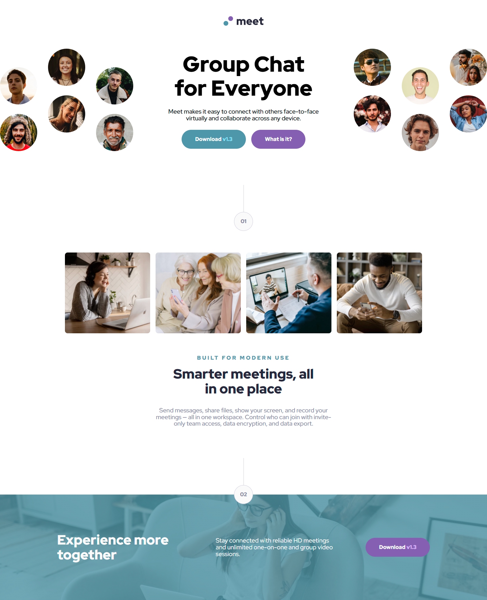

# Frontend Mentor - Meet landing page solution

This is a solution to the [Meet landing page challenge on Frontend Mentor](https://www.frontendmentor.io/challenges/meet-landing-page-rbTDS6OUR). Frontend Mentor challenges help you improve your coding skills by building realistic projects. 

## Table of contents

- [Overview](#overview)
  - [The challenge](#the-challenge)
  - [Screenshot](#screenshot)
  - [Links](#links)
- [My process](#my-process)
  - [Built with](#built-with)
  - [What I learned](#what-i-learned)
  - [Continued development](#continued-development)
- [Author](#author)

## Overview

### The challenge

Users should be able to:

- View the optimal layout depending on their device's screen size
- See hover states for interactive elements

### Screenshot



### Links

- Solution URL: [github.com/RicardoGeada/fm-meet-landing-page/](https://github.com/RicardoGeada/fm-meet-landing-page/)
- Live Site URL: [ricardogeada.github.io/fm-meet-landing-page/](https://ricardogeada.github.io/fm-meet-landing-page/)

## My process

### Built with

- Semantic HTML5 markup
- CSS custom properties
- Flexbox
- CSS Grid
- Mobile-first workflow
- [React](https://reactjs.org/) - JS library

### What I learned

1. Setting up Routing with React Router

I learned how to create client-side routes using the react-router-dom library. Here's how I set up the router for this project:

```tsx
import "./App.scss";
import { createBrowserRouter, RouterProvider } from "react-router-dom";
import Home from "./pages/Home/Home";

const router = createBrowserRouter([
  {
    path: "/",
    element: <Home />,
  },
]);

function App() {
  return <RouterProvider router={router} />;
}

export default App;
```

This structure allows for easy expansion with more routes as the project grows.

2. Creating a Custom Hook

To manage responsive design behavior, I built a custom hook called useMediaQuery. It listens for media query changes and updates the state accordingly:

```tsx
import { useEffect, useState } from "react";

export function useMediaQuery(query: string): boolean {
  const [matches, setMatches] = useState(false);

  useEffect(() => {
    const media = window.matchMedia(query);
    const updateMatch = () => setMatches(media.matches);

    updateMatch();
    media.addEventListener("change", updateMatch);
    return () => media.removeEventListener("change", updateMatch);
  }, [query]);

  return matches;
}
```

This hook makes it easier to build responsive components based on screen size.

### Continued development

Next, I want to dive deeper into state management, custom hooks, and performance in React. I'm also curious about frameworks like Next.js and tools for testing and accessibility.

## Author

- Website - [ricardogeada.com](https://www.ricardogeada.com)
- Frontend Mentor - [@RicardoGeada](https://www.frontendmentor.io/profile/RicardoGeada)


